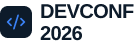
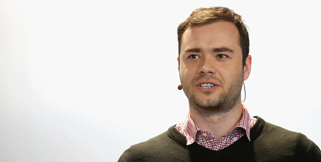
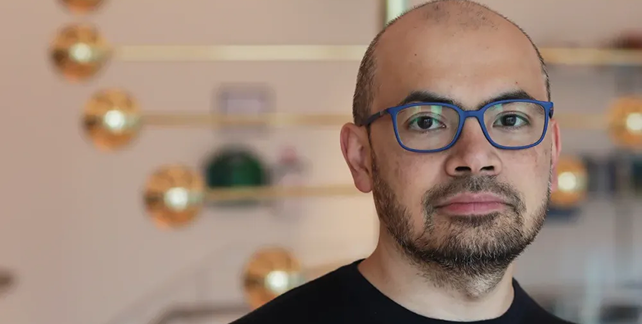

You are an award-winning UI/UX designer and a senior frontend engineer with expertise in modern SaaS and conference website design. I already have a professional developer conference landing page with these sections: 1. Hero Banner 2. Meet the Speakers 3. Pricing Plans Now design the next section that naturally follows the Pricing section. The new section title should be: Why Attend DevConf 2026? Subtitle: Everything you need to accelerate your developer career in one unforgettable event. The purpose of this section is to convince visitors why attending the conference is valuable before they continue scrolling toward registration. ----------------------------------------- Design Style ----------------------------------------- The design must perfectly match the existing website. Visual Style: • Clean • Minimal • Modern SaaS • Premium • Professional • Similar to Stripe, Linear, Vercel, GitHub, Framer and Webflow. Color Palette: Primary Blue: #2563EB Dark Navy: #0F172A White: #FFFFFF Light Gray: #F8FAFC Border: #E5E7EB Typography: Modern, clean and spacious. Spacing: Generous whitespace with consistent padding and margins. Rounded Corners: 12px Shadow: Very soft subtle shadow. Hover Effect: Cards should slightly move upward with a smooth transition and stronger shadow. ----------------------------------------- Layout ----------------------------------------- Desktop: 3 columns × 2 rows Tablet: 2 columns Mobile: 1 column Cards must all have equal height. Gap between cards: 24px Container width should match the rest of the website. ----------------------------------------- Section Content ----------------------------------------- Create six feature cards. Each card must contain: • Modern outline icon • Small category label (optional) • Feature title • Short description (one sentence) Feature Cards 1. Icon: 🎤 Title: World-Class Speakers Description: Learn directly from AI pioneers, senior software engineers, and industry leaders. ----------------------------------------- 2. Icon: 💻 Title: Hands-on Workshops Description: Build practical skills through interactive coding sessions and live demonstrations. ----------------------------------------- 3. Icon: 🤝 Title: Networking Opportunities Description: Connect with thousands of developers, founders, recruiters, and tech professionals. ----------------------------------------- 4. Icon: 📈 Title: Career Growth Description: Meet hiring companies, explore new roles, and accelerate your professional journey. ----------------------------------------- 5. Icon: 🤖 Title: AI & Emerging Technologies Description: Discover the newest innovations transforming software engineering and artificial intelligence. ----------------------------------------- 6. Icon: 🎁 Title: Conference Swag Description: Receive exclusive merchandise, digital resources, certificates, and special gifts. ----------------------------------------- Interaction ----------------------------------------- Each card should have: • White background • Thin light-gray border • Border radius 12px • Soft shadow • Smooth hover animation • Icon inside a blue circular background • Clean typography hierarchy • Consistent spacing Hover animation: • translateY(-6px) • shadow becomes slightly stronger • transition: 0.3s ease ----------------------------------------- Accessibility ----------------------------------------- Maintain excellent contrast. Readable typography. Responsive layout. Consistent spacing. ----------------------------------------- Output ----------------------------------------- Generate a complete modern section design that looks like it belongs to the same conference landing page. The section should feel premium, trustworthy, and visually impressive while maintaining the minimal aesthetic of the existing website. ----- my current code is :<!DOCTYPE html> <html lang="en"> <head> <meta charset="UTF-8"> <meta name="viewport" content="width=device-width, initial-scale=1.0"> <title>devConf 2026</title> <link rel="stylesheet" href="./style.css"> <link rel="preconnect" href="https://fonts.googleapis.com"> <link rel="preconnect" href="https://fonts.gstatic.com" crossorigin> <link href="https://fonts.googleapis.com/css2?family=Inter:ital,opsz,wght@0,14..32,100..900;1,14..32,100..900&display=swap" rel="stylesheet"> </head> <body> <header class="container"> <nav class="nav-parent"> 
  
 
 <ul class="nav-ul"> <li>Speakers</li> <li>Schedule</li> <li>Tracks</li> <li>Venue</li> <li>Blog</li> </ul> 
 
 <button class="common-btn">Register Now</button> 
 </nav> </header> <main> <section class="hero-section"> 
 
 <h1>Code. <em>Connect.</em>Create</h1> 
 Join 4,000+ engineers, founders, and builders at the premier developer conference of 2026. Three days of cutting-edge talks, hands-on workshops, and meaningful connections. 
 
 
 <button class="common-btn">Register Now</button> 
 
 </section> <!-- meet the speakers section--> <section class="speakers-parent "> 
 <h1>Meet the Speakers</h1> 
 
 
  
AI/ML
 <h3>Andrej Karpathy</h3> 
Pretraining team, Anthropic
 
 
  
Cloud & DevOps
 <h3>Demis Hassabis</h3> 
Co-Founder and CEO, Google DeepMind
 
 
  
Frontend
 <h3>Gary Marcus</h3> 
Staff Engineer, Vercel
 
 
  
Security
 <h3>Mustafa Suleyman</h3> 
CEO of Microsoft AI
 
 
 </section> <!--Pricing section --> <section class=" pricing-section container"> 
 <h2>Secure Your Spot</h2> 
Early-bird pricing ends August 15, 2026.
 
 
 
 
Standard
 <h2>$399</h2> 
per person
 
 <ul> <li>Access to all 3 conference days</li> <li>48 curated technical talks</li> <li>2 workshop sessions</li> <li>Networking lunch & coffee breaks</li> <li>Conference swag bag</li> <li>Digital recordings (30 days)</li> </ul> <button class="outline-btn">Get Started</button> 
 
 
Pro
 <h2>$749</h2> 
per person
 
 <ul> <li>Everything in Standard</li> <li>Unlimited workshop access</li> <li>Speaker meet & greet</li> <li>VIP networking dinner</li> <li>Lifetime recording access</li> <li>1-on-1 mentorship (30 min)</li> </ul> <button class="common-btn">Get pro</button> 
 
 
Team
 <h2>$5,999</h2> 
up to 10 people
 
 <ul> <li>Everything in Pro (10 seats)</li> <li>Dedicated team lounge access</li> <li>Private workshop booking</li> <li>Company logo on event page</li> <li>Recruitment booth (1 day)</li> <li>Priority customer support</li> </ul> <button class="outline-btn three-btn">Contact Us</button> 
 
 </section> <footer> 
  
 </footer> </main> </body> </html> /*nav bar design start*/ * { margin: 0; font-family: "Inter", sans-serif; } .container { max-width: 1000px; margin: auto; } .nav-parent { display: flex; justify-content: space-between; align-items: center; padding-top: 20px; padding-bottom: 25px; } .nav-ul { color: #575757; list-style-type: none; display: flex; justify-content: space-between; gap: 24px; } .common-btn { cursor: pointer; padding: 10px 25px; font-weight: 550; color: white; background-color:#2563EB; border-radius: 8px; } /*hero section*/ .hero-section { /* min-height: 650px; */ background-image: linear-gradient(rgba(4, 4, 4, 0.45), rgba(0, 0, 0, .45)), url("./assets/banner.jpg"); background-repeat: no-repeat; background-size: cover; background-position: center; } .hero-parent { display: flex; flex-direction: column; justify-content: center; align-items: center; /* height: 500px; */ text-align: center; min-height: 500px; } .hero-content { color: white; max-width: 700px; } .hero-content h1 { font-weight: bold; padding-bottom: 20px; } .hero-content p { padding-bottom: 60px; } .hero-btn { margin-top: 120px; } /*meet the speakers section */ .spekers-tile h1 { text-align: center; padding-bottom: 50px; padding-top: 50px; } .speakers-images { display: grid; grid-template-columns: repeat(2, 1fr); gap: 25px; justify-content: center; } .speakers-images div { border: 1px solid #dcdcdc; border-radius: 12px; } .speakers-images div h3, p { padding: 5px 5px 5px 20px; } .speakers-images img { width: 500px; border-top-right-radius: 12px; border-top-left-radius: 12px; } .speakers-images div p { color: #575757; font-size: 15px; } .speakers-p { color:#2563EB; font-size: 10px !important; } /*pricing table section*/ .pricing-title { padding-top: 100px; padding-bottom: 40px; text-align: center; } .pricing-title h2 { font-weight: bold; font-size: 30px; padding-bottom: 15px; } .pricing-section p { color: #575757; font-size: 15px; } .pricing-table-parents { display: flex; justify-content: center; gap: 20px; } .pricing-table-parents div { border: 1px solid #d1d5db; border-radius: 10px; padding: 24px; } .pricing-table-parents div h2{ padding-left: 25px ; } .pricing-table-parents div p{ padding-bottom:10px; } .pricing-table-parents div ul{ padding-top: 20px; padding-bottom: 20px; } .pricing-table-parents div ul li{ padding-bottom: 5px; l; } .outline-btn { cursor: pointer; padding: 10px 25px; font-weight: bold; color: #2563EB; background-color: white; border-radius: 8px; align-self: center; } .outline-btn, .common-btn{ display: block; margin: 0 auto; padding: 10px 40px; } .highlighted-pricing-table{ background-color: #0D1B2A; } .highlighted-pricing-table ul{ color: #575757; } .highlighted-pricing-table h2{ color:white; } li::marker{ color:#2563EB; } .three-table{ background-color: #e8ebf3; } .three-btn{ background-color: #e8ebf3; } .pro{ color: #2563EB; }amake amar ei code er and color theme onujayi oi section tar jonno code likhe dao